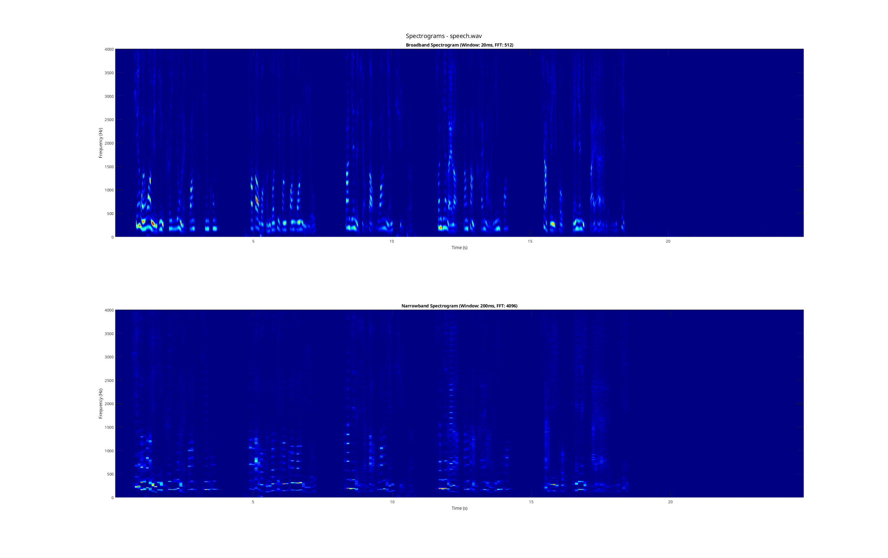
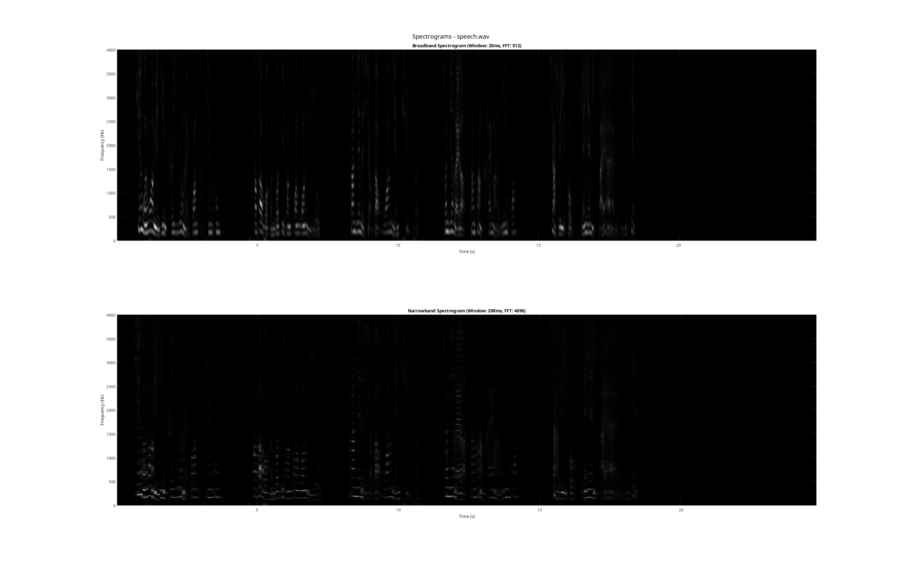
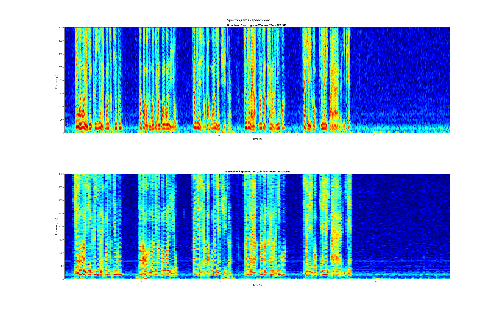
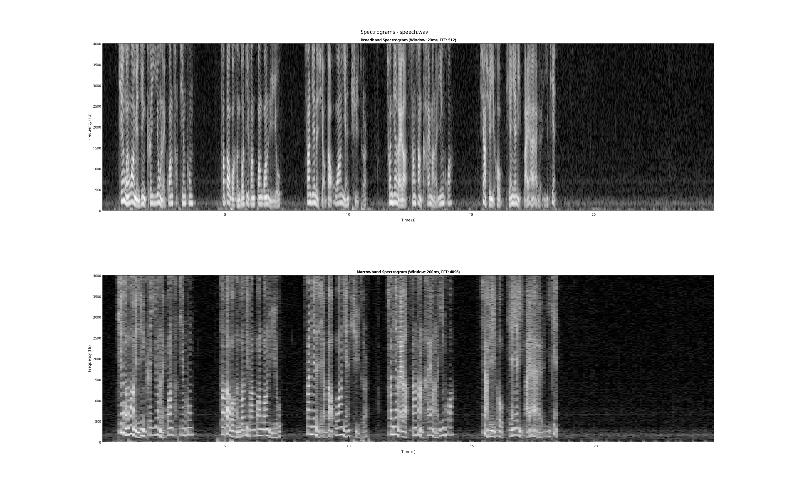
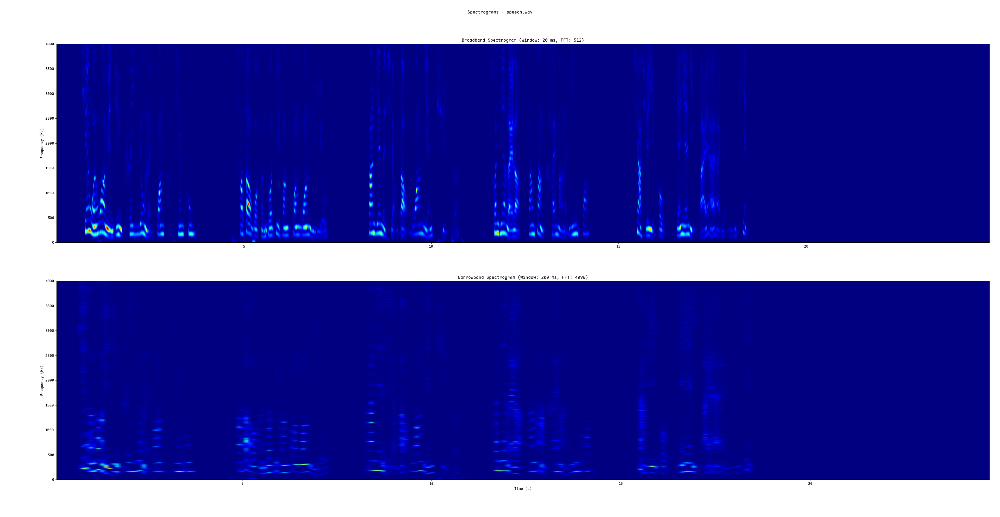
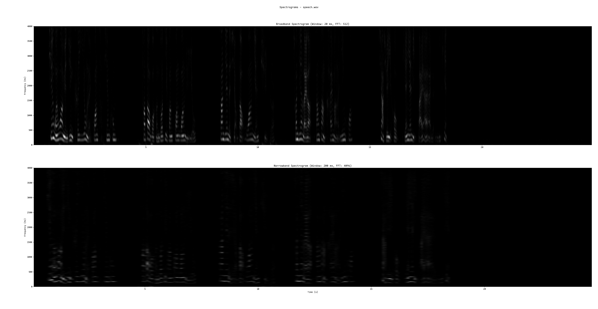
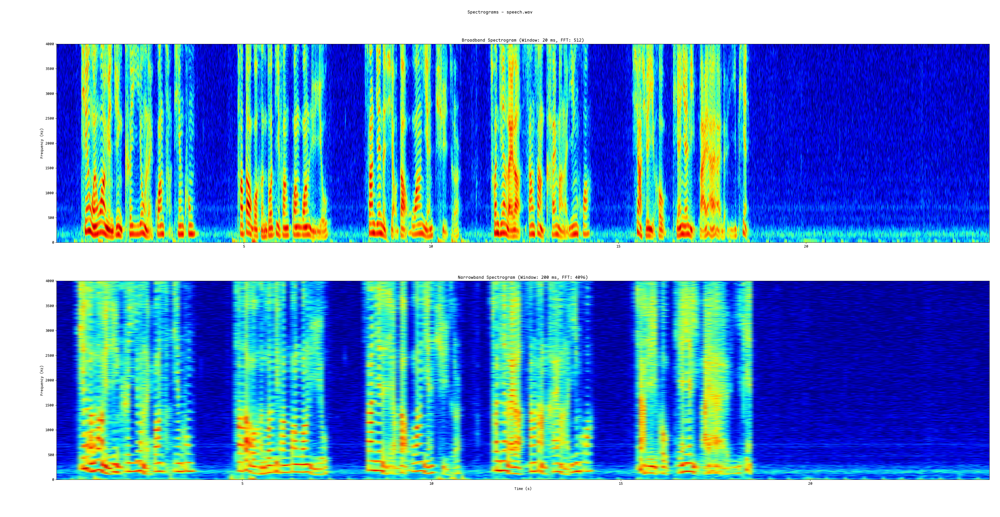
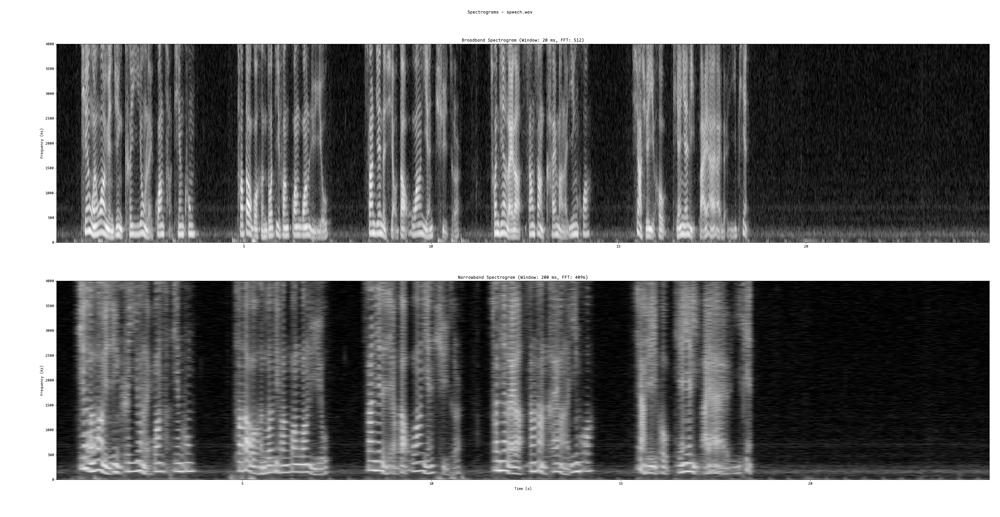

# LAB_2

> 基本参数如下：
>
> 降采样率为8kHz
>
> 宽带窗长20ms
>
> 窄带窗长200ms
>
> 宽带FFT长度为512
>
> 窄带FFT长度为4096
>
> 动态范围是80dB

## 基于`Matlab`的程序运行结果

### 彩色图+使用线性幅度

### 灰度图+使用线性幅度

### 彩色图+使用对数幅度

### 灰度图+使用对数幅度

## 基于`Python`的程序运行结果

### 彩色图+使用线性幅度

### 灰度图+使用线性幅度

### 彩色图+使用对数幅度

### 灰度图+使用对数幅度

