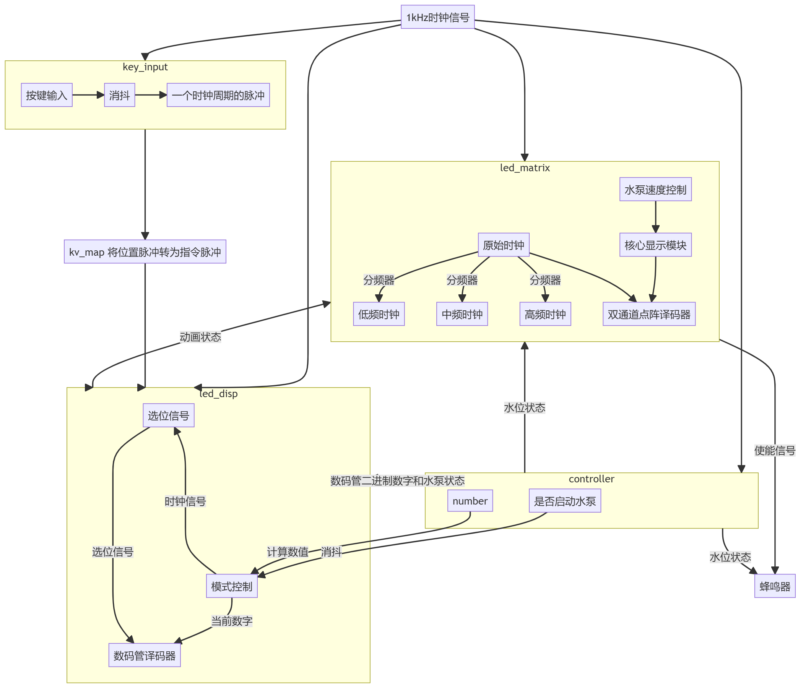
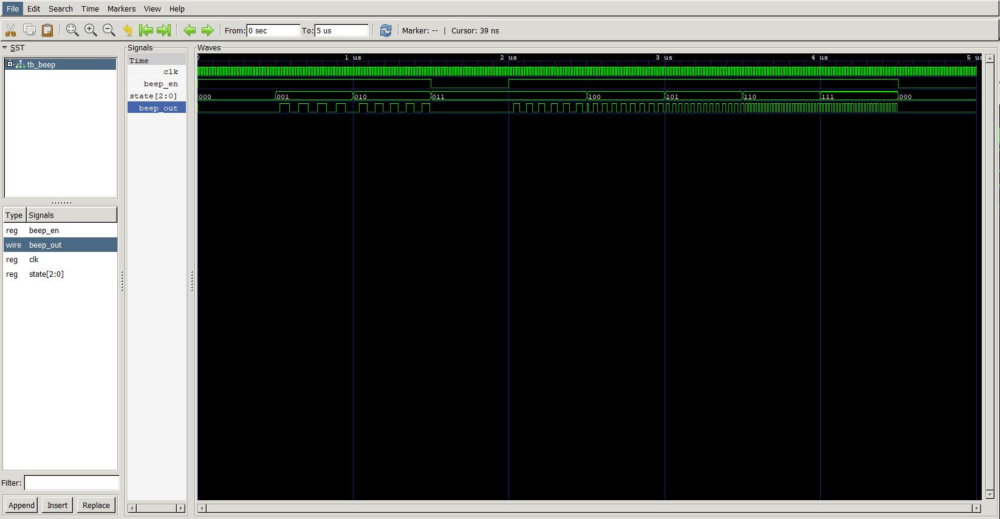
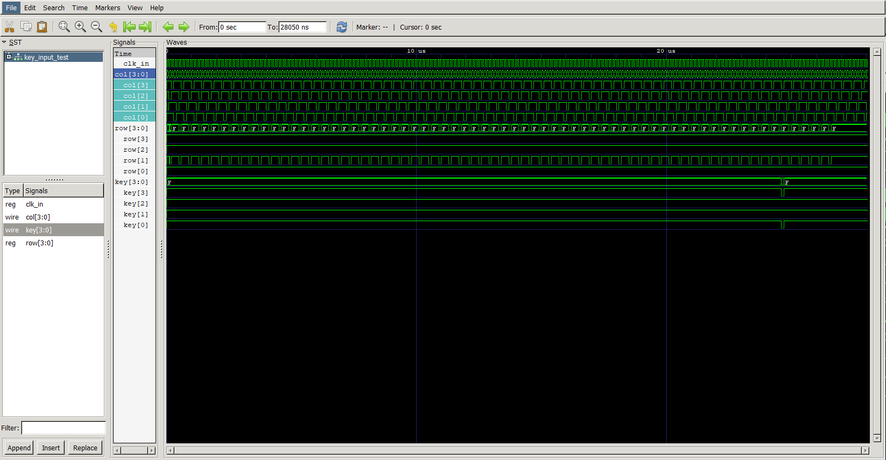
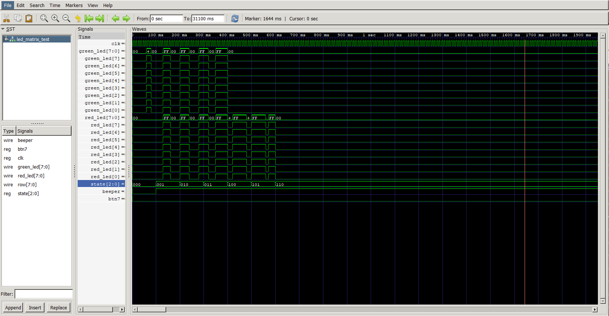
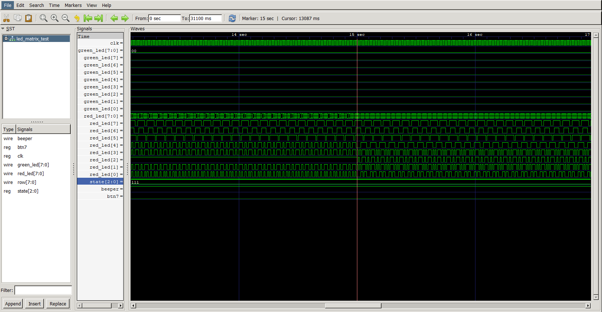
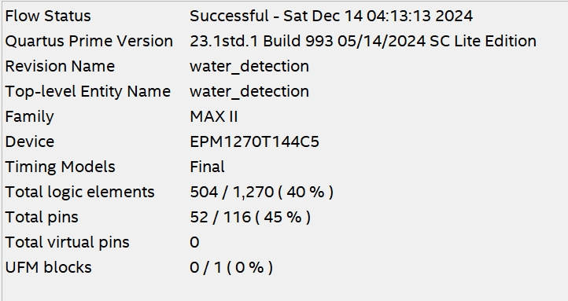

# 数字系统设计实验报告——水位监测

## 设计课题的任务要求

模拟一个水位监测系统，通过控制点阵、数码管等显示水位信息，当水位超出范围时进行报警，具体情况和系统功能要求如下：

### 基本要求

1. 通过`SW4~SW0`的值来确定当前水位，其中`SW4~SW1`表示整数位，`SW0`表示小数位，`0~6`米（含）为安全水位，`6~12`米（含）为警惕水位，`12`米以上为危险水位。

2. 用数码管`DISP2~DISP0`显示水位数值，显示到小数点后`1`位。

3. 用点阵显示水位变化示意图：当水位低于等于`6`米时，点阵最下面`2`行显示全绿；当水位在“警惕水位”时，点阵显示黄色，`6~8`米（含）时，亮下面`3`行，`8~10`米（含）时，亮下面`4`行，`10~12`米（含）时，亮下面`5`行；当水位在“危险水位”，点阵显示红色，`12~13`米（含）时，亮下面`6`行，`13~14`米（含）时，亮下面`7`行，`14`米以上时，点阵全亮，且以`2Hz`的频率闪烁。

4. 水位处于“警惕水位”或“危险水位”时，蜂鸣器发出报警声，报警声音的音调随水位增高而增高。

5. 水位处于“危险水位”时，按`BTN0`启动点阵动画模拟水泵抽水，抽水动画自行设计，直至水位降至“安全水位”，点阵恢复显示水位变化。

6. 水泵抽水速度“慢”、“中”、“快”三档可调，在数码管`DISP7`上分别显示`1`、`2`、`3`表示三种速度，通过`BTN7`按键进行循环切换，不同速度时抽水动画的变化速度也同步进行变化。

### 提高要求

1. 水位值可通过`4x4`键盘输入。

2. 自拟其他功能。

### 模块电路要求

在`8x8`双色点阵上设计并实现水泵抽水的动画显示，动画图案自行设计，要求完成仿真并在实验板上下载显示。

## 系统设计

### 设计思路

以功能要求作为模块区分的参考，同时针对开发板的实际硬件区分和功能实现，我对整个程序进行了以下的模块拆分：

| water_detection | key_input | kv_map   | beep  | div_clk |
| --------------- | --------- | -------- | ----- | ------- |
| 主模块             | 按键输入模块    | 按键功能映射模块 | 蜂鸣器模块 | 分频器模块   |

| debounce | digi_screen   | controller | led_disp |
| -------- | ------------- | ---------- | -------- |
| 按键消抖模块   | HEX到LED点阵译码模块 | LED点阵控制模块  | 数码管控制模块  |

| segment7       | select_disp | led_matrix  |
| -------------- | ----------- | ----------- |
| 数码管译码模块（包含小数点） | 数码管选位信号模块   | LED点阵动画显示模块 |

### 总体框图



### 分块设计

- `water_detection`：顶层模块，负责将所有模块实例化。

- `key_input`：IO，读取按键输入、消抖，并转成对应的脉冲信号

- `kv_map`：Key-Value模块，将`key_input`的输入转成对应的指令进行控制，使输入的拓展性大大增加。

- `beep`：IO，根据传入的状态调节音调。

- `div_clk`：基本模块，可以对系统时钟进行分频，支持修改参数。

- `debounce`：基本模块，用于单个按钮的消抖。

- `digi_screen`：基本模块，用于将HEX转成LED矩阵数据。

- `controller`：控制器，可以将输入的8421BCD码数字转成二进制数并比较，得到当前的水位状态。

- `led_disp`：IO，负责数码管的相关显示。

- `segment7`：译码器，实现8421BCD码到人类可读数码管的译码。

- `select_disp`：脉冲分配器，用于生成数码管的选位信号。

- `led_matrix`：IO，负责LED点阵的相关显示。

## Verilog HDL 代码

### `water_detection.v`

```verilog
// water_detection.v
module water_detection(
    input wire clk,       // 系统时钟
    input btn7,           // 水泵挡位
    input btn0,           // 水泵开关
    input [3:0] row_in,
    output [3:0] col,
    output [6:0] segment7, // 数码管信号
    output [7:0] row,
    output [7:0] green_led,
    output [7:0] red_led,
    output [7:0] select, // 数码管选位信号
    output beep,
    output dp            // 小数点信号
);
    wire [3:0] key;
    wire [3:0] value;
    wire [7:0] number;      // 整数部分
    wire [2:0] state;       // 水位状态
    wire [1:0] Anime_state; // 水泵状态
    wire beeper;

// 模块实例化部分，具体内容参考后续代码
key_input key_input1(
    .clk(clk),
    .row(row_in),
    .col(col),
    .key(key)
);
kv_map kv_map1(
    .key(key),
    .value(value)
);
led_disp led_disp1(
    .clk(clk),
    .key(value),
    .select(select),
    .segment7x(segment7),
    .number_out(number),
    .dp(dp),
    .Anime_state(Anime_state),
    .state(state)
);
controller controller1(
    .clk(clk),
    .number(number),
    .btn0(btn0),
    .state(state)
);
led_matrix led_matrix1(
    .clk(clk),
    .state(state),
    .btn7(btn7),
    .red_led(red_led),
    .green_led(green_led),
    .row(row),
    .beeper(beeper),
    .Anime_state(Anime_state)
);
beep beep1(
    .clk(clk),
    .beep_en(beeper),
    .state(state),
    .beep_out(beep)
);
endmodule
```

### `key_input.v`

```verilog
// key_input.v
module key_input(
    input wire clk,      //1khz
    input wire [3:0] row,
    output reg [3:0] col,
    output reg [3:0] key //已经消抖并且产生一周期信号的脉冲，默认空信号为1111
);
    reg [3:0] key_unconfirmed;
    reg [31:0] counter;
    reg [3:0] key_pre;

initial begin 
    col = 4'b1110;
    counter = 0;
    key_pre = 4'b1111;
    key_unconfirmed = 4'b1111;
    key = 4'b1111;
end
// 选位信号发生器
always @(negedge clk) begin
    col <= {col[2:0],col[3]}; 
end
// 同步检测
always @(posedge clk) begin
    case(row)
        4'b1110: begin
            case(col)
                4'b1110: key_unconfirmed = 4'b0000;
                4'b1101: key_unconfirmed = 4'b0001;
                4'b1011: key_unconfirmed = 4'b0010;
                4'b0111: key_unconfirmed = 4'b0011;
            endcase
        end
        4'b1101: begin
            case(col)
                4'b1110: key_unconfirmed = 4'b0100;
                4'b1101: key_unconfirmed = 4'b0101;
                4'b1011: key_unconfirmed = 4'b0110;
                4'b0111: key_unconfirmed = 4'b0111;
            endcase
        end
        4'b1011: begin
            case(col)
                4'b1110: key_unconfirmed = 4'b1000;
                4'b1101: key_unconfirmed = 4'b1001;
                4'b1011: key_unconfirmed = 4'b1010;
                4'b0111: key_unconfirmed = 4'b1011;
            endcase
        end
        4'b0111: begin
            case(col)
                4'b1110: key_unconfirmed = 4'b1100;
                4'b1101: key_unconfirmed = 4'b1101;
                4'b1011: key_unconfirmed = 4'b1110;
                4'b0111: key_unconfirmed = 4'b1111;
            endcase
        end
        default: key_unconfirmed = 4'b1111;
    endcase
end

// 消抖
always@(negedge clk) begin // 每次在下降沿检测
    if (key_unconfirmed != 4'b1111) begin
        if (key_pre == key_unconfirmed) begin
            if (counter == 60) begin // 检测到连续不断的60次key才认可这次输入
                key = key_unconfirmed;
                counter = 0;
            end else begin
                counter = counter + 1;
            end
        end else begin
            counter = 0;
            key_pre = key_unconfirmed;
        end
    end else begin
        key = 4'b1111;
    end
end
endmodule 
```

### `kv_map.v`

```verilog
// kv_map.v
module kv_map(
    input [3:0] key,
    output reg [3:0] value  //将4*4的键盘映射到8421BCD码&点和清零
);
// 代码简单，主要是提高可读性和可拓展性
    always @(*) begin
        case(key)
            4'b0000: value = 4'b0000; //0
            4'b1100: value = 4'b0001; //1
            4'b1101: value = 4'b0010; //2
            4'b1110: value = 4'b0011; //3
            4'b1000: value = 4'b0100; //4
            4'b1001: value = 4'b0101; //5
            4'b1010: value = 4'b0110; //6
            4'b0100: value = 4'b0111; //7
            4'b0101: value = 4'b1000; //8
            4'b0110: value = 4'b1001; //9
            4'b0001: value = 4'b1010; //dot
            4'b0010: value = 4'b1011; //reset
            default: value = 4'b1111;
        endcase
    end
endmodule
```

### `div_clk.v`

```verilog
// div_clk.v
module div_clk #(
    parameter DIVISOR = 100 // 默认100
)(
    input wire clk_in,      // 系统时钟
    input wire rst,         // 复位
    output reg clk_out      // 输出分频结果
);

    reg [9:0] counter;     // 计数器，最高支持分频2^10
    initial begin
        clk_out = 0;
        counter = 0;
    end
    always @(negedge clk_in or posedge rst) begin // 异步复位
        if (rst) begin
            counter <= 0;
            clk_out <= 0;
        end else begin
            if (counter == (DIVISOR/2 - 1)) begin
                clk_out <= ~clk_out;
                counter <= 0;
            end else begin
                counter <= counter + 1;
            end
        end
    end
endmodule
```

### `select_disp.v`

```verilog
// select_disp.v
module select_disp (    //选位信号
    input wire clk,       // 输入时钟
    input wire rst_n,     // 低电平有效的复位
    output reg [3:0] out  // 4位输出（适应于这次的实验）
);

initial begin
    out = 4'b0111;
end

always @(posedge clk) begin
    if (!rst_n) begin
        out <= 4'b0111;
    end else begin
        out <= {out[2:0], out[3]}; // 左移一位
    end
end
endmodule
```

### `segment7.v`

```verilog
// segment7.v
module segment7(
    input [3:0] num,       // 四位输入信号
    input dp_in,           // 小数点
    output reg [6:0] seg7, // 数码管信号
    output reg dp
);
    always @(num) begin
        case(num)
            4'b0000:seg7=7'b1111110;
            4'b0001:seg7=7'b0110000;
            4'b0010:seg7=7'b1101101;
            4'b0011:seg7=7'b1111001;
            4'b0100:seg7=7'b0110011;
            4'b0101:seg7=7'b1011011;
            4'b0110:seg7=7'b1011111;
            4'b0111:seg7=7'b1110000;
            4'b1000:seg7=7'b1111111;
            4'b1001:seg7=7'b1111011;
            default:seg7=7'b0000001;
        endcase
    end
    always @(dp_in) begin
        dp = dp_in;
    end
endmodule
```

### `led_disp.v`

```verilog
// led_disp.v
module led_disp(
    input clk,            // 系统时钟
    input [3:0] key,      // 输入指令脉冲
    output [7:0] select,
    output [6:0] segment7x,
    output [7:0] number_out, // 用户输入的结果
    output dp,
    input [1:0] Anime_state, // 动画状态，和下方的state共同控制风扇转速显示
    input [3:0] state
);

    reg [3:0] num;
    reg [11:0] number;
    reg dp_in;
    wire [3:0] select_n;
    initial begin
        number = 12'hfff;
        num = 4'b0000;
        dp_in = 1'b0;
    end
    always @(negedge clk) begin
        if (key != 4'b1111) begin
            if (key == 4'b1011) begin
                number = 12'hfff;
            end else begin
                number = {number[7:0],key}; // 将用户输入储存下来，并移位
            end
        end
    end
    select_disp slct(  // 实例化选位信号
        .clk(clk),
        .rst_n(1'b1),
        .out(select_n)
    );
    segment7 decoder(  // 实例化译码器
        .dp_in(dp_in),
        .num(num),
        .seg7(segment7x),
        .dp(dp)

    );
    assign number_out = number[11:4];                    // 取整数部分
    assign select = {select_n[3],4'b1111,select_n[2:0]}; // 选位信号生成


    always@(select_n) begin
// select_n主要功能是显示对应数码管的数字，并将值传入数码管对应管脚
        case(select_n)
        4'b1110:begin
            num <= number[3:0];
            dp_in<=1'b0;
        end
        4'b1101:begin
            num <= number[7:4];
            dp_in<=1'b1;
        end
        4'b1011:begin
            num <= number[11:8];
            dp_in<=1'b0;
        end
        4'b0111:begin
            if (state == 3'b111) begin // 要是水泵工作模式
                case(Anime_state) // 根据Anime_state 显示对应挡位
                2'b00:begin num = 4'b0001; dp_in<=1'b0;end
                2'b01:begin num = 4'b0010; dp_in<=1'b0;end
                2'b10:begin num = 4'b0011; dp_in<=1'b0;end
                endcase
            end else begin
                num <= 4'b1111;
                dp_in<=1'b0;
            end
        end
        default: begin num = 4'b1111; dp_in<=1'b0;end
        endcase
    end
endmodule
```

### `digi_screen.v`

```verilog
// digi_screen.v
// https://xantorohara.github.io/led-matrix-editor
module digi_screen
(
    input wire clk,
    input [63:0] PICTURE_G, // 64*64 picture
    input [63:0] PICTURE_R, // 64*64 picture  
    output reg [7:0] row,
    output reg [7:0] col_r,
    output reg [7:0] col_g
);
    initial begin
        row = 8'b0111_1111;
    end

    always@(negedge clk) begin // 行扫描信号
        row <= {row[6:0], row[7]};

    end

    always@(negedge clk) begin //列信号，主要是对信号做分配
        case(row)
        8'b1111_1110: begin
            col_r <= PICTURE_R[15:8];
            col_g <= PICTURE_G[15:8];
        end
        8'b1111_1101: begin
            col_r <= PICTURE_R[23:16];
            col_g <= PICTURE_G[23:16];
        end
        8'b1111_1011: begin
            col_r <= PICTURE_R[31:24];
            col_g <= PICTURE_G[31:24];
        end
        8'b1111_0111: begin
            col_r <= PICTURE_R[39:32];
            col_g <= PICTURE_G[39:32];
        end
        8'b1110_1111: begin
            col_r <= PICTURE_R[47:40];
            col_g <= PICTURE_G[47:40];
        end
        8'b1101_1111: begin
            col_r <= PICTURE_R[55:48];
            col_g <= PICTURE_G[55:48];
        end
        8'b1011_1111: begin
            col_r <= PICTURE_R[63:56];
            col_g <= PICTURE_G[63:56];
        end
        8'b0111_1111: begin
            col_r <= PICTURE_R[7:0];
            col_g <= PICTURE_G[7:0];
        end
        default: begin
            col_r <= 8'h00;
            col_g <= 8'h00;
        end
        endcase
    end

endmodule
```

### `led_matrix.v`

```verilog
// led_matrix.v
module led_matrix(//在8x8的led矩阵上显示动画，同时发出蜂鸣器声音，包含七个水位挡位，和一位按钮控制动画状态
    input clk,
    input [2:0] state,
    input btn7,
    output [7:0] red_led,
    output [7:0] green_led,
    output [7:0] row,
    output reg beeper,
    output reg [1:0] Anime_state

);
    wire clk_div_r2;
    wire clk_low;
    wire clk_middle;
    wire clk_high;
    wire key_pulse;

    div_clk #(         // 水泵1挡
        .DIVISOR(1000)
    )
    div_clk_low (
        .clk_in(clk),
        .rst(),
        .clk_out(clk_low)
    );

    debounce dbsa(         // 按键消抖
        .clk(clk),
        .rst(),
        .key(btn7),
        .key_pulse(key_pulse)
    );
    div_clk #(         // 水泵2挡
        .DIVISOR(500)
    )
    div_clk_mid (
        .clk_in(clk),
        .rst(),
        .clk_out(clk_middle)
    );

    div_clk #(         // 水泵3挡
        .DIVISOR(250)
    )
    div_clk_high (
        .clk_in(clk),
        .rst(),
        .clk_out(clk_high)
    );

    div_clk #(         // 水泵动画2Hz分频
        .DIVISOR(500)
    ) div_clk_2Hz (
        .clk_in(clk),
        .rst(),
        .clk_out(clk_div_r2)
    );

    reg [63:0] r_led;
    reg [63:0] g_led;


    initial begin
        beeper = 1'b0;
        Anime_state = 2'b00;
        r_led = 0;
        g_led = 0;
    end
    always@(posedge key_pulse) begin // 模3计数器，用于控制水泵速度
        if (Anime_state == 2'b10)
            Anime_state = 2'b00;
        else
            Anime_state = Anime_state + 1;
    end

    digi_screen digi_screen_red ( // 8*8LED点阵模块实例化
        .PICTURE_G(g_led),
        .PICTURE_R(r_led),
        .clk(clk),
        .row(row),
        .col_r(red_led),
        .col_g(green_led)
    );

    always@(negedge clk)begin
        case(state)
            3'b000:begin g_led =64'hffff000000000000;r_led = 64'h0000000000000000; beeper = 1'b0;end
            3'b001:begin g_led =64'hffffff0000000000;r_led = 64'hffffff0000000000; beeper = 1'b1;end
            3'b010:begin g_led =64'hffffffff00000000;r_led = 64'hffffffff00000000; beeper = 1'b1;end
            3'b011:begin g_led =64'hffffffffff000000;r_led = 64'hffffffffff000000; beeper = 1'b1;end
            3'b100:begin g_led =64'h0000000000000000;r_led = 64'hffffffffffff0000; beeper = 1'b1;end
            3'b101:begin g_led =64'h0000000000000000;r_led = 64'hffffffffffffff00; beeper = 1'b1;end
            3'b110:begin // 动画设计
                case(clk_div_r2)
                1'b0:begin g_led =64'h0000000000000000;r_led = 64'h0000000000000000; end
                1'b1:begin g_led =64'h0000000000000000;r_led = 64'hffffffffffffffff; end
                endcase
                beeper = 1'b1;
                end
            3'b111:begin
                case(Anime_state)
                2'b00:begin 
                case(clk_low)
                    1'b0:begin g_led =64'h0000000000000000;r_led = 64'ha4e4ffe4e4bf1e3f; end
                    1'b1:begin g_led =64'h0000000000000000;r_led = 64'hb1eae4eaf1bf1e3f; end
                endcase
                beeper = 1'b1;
                end
                2'b01:begin
                case(clk_middle)
                    1'b0:begin g_led =64'h0000000000000000;r_led = 64'ha4e4ffe4e4bf1e3f; end
                    1'b1:begin g_led =64'h0000000000000000;r_led = 64'hb1eae4eaf1bf1e3f; end
                endcase
                beeper = 1'b1;
                end
                2'b10:begin
                case(clk_high)
                    1'b0:begin g_led =64'h0000000000000000;r_led = 64'ha4e4ffe4e4bf1e3f; end
                    1'b1:begin g_led =64'h0000000000000000;r_led = 64'hb1eae4eaf1bf1e3f; end
                endcase
                beeper = 1'b1;
                end
                endcase
             end
        endcase
    end          
endmodule
```

### `controller.v`

```verilog
// controller.v
module controller(
    input wire clk,
    input [7:0] number,
    input wire btn0,
    output reg [2:0] state
);
    wire key;
    reg [6:0] integer_value;
    reg mode; // 水泵工作状态
initial begin
    mode = 0;
    integer_value = 7'b000_0000;
end
    // 处理按钮切换模式
    debounce dbs (  // 状态按钮消抖
        .clk(clk),
        .rst(1'b0),
        .key(btn0),
        .key_pulse(key)
    );

    always@(posedge key) begin
        mode =~mode;
    end

    // 处理number和dp_list，计算state
    always @(*) begin
        integer_value =number[7:4] * 10+number[3:0];

        // 根据模式设置state
        if (mode && integer_value >= 14) begin
            state = 3'b111;
        end else begin
            if (integer_value < 6) begin
                state = 3'b000;
            end else if (integer_value < 8) begin
                state = 3'b001;
            end else if (integer_value < 10) begin
                state = 3'b010;
            end else if (integer_value < 12) begin
                state = 3'b011;
            end else if (integer_value < 13) begin
                state = 3'b100;
            end else if (integer_value < 14) begin
                state = 3'b101;
            end else begin
                state = 3'b110;
            end
        end
    end

endmodule
```

### `beep.v`

```verilog
// beep.v
module beep(
    input clk,
    input beep_en,
    input [2:0] state,
    output beep_out
);
// 以下分频可以根据状态控制音调
wire beep_out_state0,beep_out_state1,beep_out_state2,beep_out_state3,beep_out_state4,beep_out_state5;
div_clk #(.DIVISOR(12)) div_clk_beep1 (.clk_in(clk),.rst(),.clk_out(beep_out_state0));
div_clk #(.DIVISOR(10)) div_clk_beep2 (.clk_in(clk),.rst(),.clk_out(beep_out_state1));
div_clk #(.DIVISOR(8)) div_clk_beep3 (.clk_in(clk),.rst(),.clk_out(beep_out_state2));
div_clk #(.DIVISOR(6)) div_clk_beep4 (.clk_in(clk),.rst(),.clk_out(beep_out_state3));
div_clk #(.DIVISOR(4)) div_clk_beep5 (.clk_in(clk),.rst(),.clk_out(beep_out_state4));
div_clk #(.DIVISOR(2)) div_clk_beep6 (.clk_in(clk),.rst(),.clk_out(beep_out_state5));

assign beep_out = !beep_en ? 1'b0 : state == 3'b000) ? 1'b0 :
                  (state == 3'b001) ? beep_out_state0 :
                  (state == 3'b010) ? beep_out_state1 :
                  (state == 3'b011) ? beep_out_state2 :
                  (state == 3'b100) ? beep_out_state3 :
                  (state == 3'b101) ? beep_out_state4 :
                  (state == 3'b110) ? beep_out_state5 :
                  (state == 3'b111) ? beep_out_state5 :
                  1'b0;
endmodule
```

### `debounce.v`

```verilog
// debounce.v
module debounce(
    input clk,
    input rst,
    input key,
    output reg key_pulse
);
    reg [3:0] cnt;
    reg flag ;

initial begin
    cnt <= 4'b0000;
    key_pulse <= 1'b0;
    flag = 1'b0;
end

always @(posedge clk) begin
    if (rst) begin
        cnt <= 4'b0000;
        key_pulse <= 1'b0;
        flag = 1'b0;
    end else if (key) begin
        if (cnt == 4'b1111 && flag == 1'b0 ) begin
        // 计数器数到16并且这16个周期内状态无变化则表示按键按下去了
            key_pulse = 1'b1;
            flag = 1'b1;
            cnt = 4'b0000;
        end else if (cnt != 4'b1111) begin
            cnt = cnt + 4'b0001;
            key_pulse = 1'b0;
        end else begin
            key_pulse = 1'b0;
            flag = 1'b1;
        end

    end else if (!key) begin
        flag = 0;
    end
end

endmodule
```

## 仿真波形及波形分析

### `beep.v` 仿真波形



不难看出，随着状态码的变化，`beep_out`的频率也随之发生变化，`beep_en`起到了使能的作用。

### `key_input.v`仿真波形



当连续60次扫描到按键按下时，就会产生一个脉冲信号。

### `led_matrix.v` 仿真波形



在前期，状态控制码较小时，此时绿灯红灯亮灭情况如上，黄灯即是红灯和绿灯均亮的时刻，注意到在黄灯及以上状态时`beeper`使能信号正常工作。


在水位超出警戒线后，按下`btn7`则屏幕开始显示抽水动画。



在`指定`的肉眼可分辨频率下进行图像的切换。

总体仿真因时间过长在此不再进行，具体情况可以烧录进开发版后自行测试。

## 功能说明及资源利用情况

### 实现的功能

- 通过`SW4~SW0`的值来确定当前水位，其中`SW4~SW1`表示整数位，`SW0`表示小数位，`0~6`米（含）为安全水位，`6~12`米（含）为警惕水位，`12`米以上为危险水位。

- 通过`4x4`键盘输入水位值。

- 用点阵显示水位变化示意图：当水位低于等于`6`米时，点阵最下面`2`行显示全绿；当水位在“警惕水位”时，点阵显示黄色，`6~8`米（含）时，亮下面`3`行，`8~10`米（含）时，亮下面`4`行，`10~12`米（含）时，亮下面`5`行；当水位在“危险水位”，点阵显示红色，`12~13`米（含）时，亮下面`6`行，`13~14`米（含）时，亮下面`7`行，`14`米以上时，点阵全亮，且以`2Hz`的频率闪烁。

- 水位处于“警惕水位”或“危险水位”时，蜂鸣器发出报警声，报警声音的音调随水位增高而增高。

- 水位处于“危险水位”时，按`BTN0`启动点阵动画模拟水泵抽水，抽水动画自行设计，直至水位降至“安全水位”，点阵恢复显示水位变化。

- 水泵抽水速度“慢”、“中”、“快”三档可调，在数码管`DISP7`上分别显示`1`、`2`、`3`表示三种速度，通过`BTN7`按键进行循环切换，不同速度时抽水动画的变化速度也同步进行变化。

### 资源利用情况

### 编译结果


可以看到，源代码顺利通过编译。

### 资源利用情况



可以看到，总共有`504`个逻辑元件。

## 故障及问题分析

### 1. 按键输入故障

- **问题描述**：按键可能因为硬件损坏或软件消抖处理不当导致输入错误。
- **分析**：检查`key_input.v`和`debounce.v`模块，确保消抖逻辑正确实现，以及硬件按键是否物理损坏。

### 2. 数码管显示错误

- **问题描述**：数码管可能因为译码错误或选位信号不正确而显示错误。
- **分析**：检查`segment7.v`和`select_disp.v`模块，确保数码管译码和选位信号生成正确。

### 4. 水位监测逻辑错误

- **问题描述**：水位监测逻辑可能因为状态判断错误导致报警或水泵控制不当。
- **分析**：检查`controller.v`模块，确保水位状态判断和水泵控制逻辑正确。

### 7. 资源利用不足或浪费

- **问题描述**：资源利用不足可能导致功能无法实现，资源浪费可能导致成本增加。
- **分析**：根据资源利用情况，优化设计，减少不必要的资源占用。

## 总结和结论

本设计成功实现了一个水位监测系统，通过控制点阵、数码管等显示水位信息，并在水位超出范围时进行报警。系统功能包括水位监测、水泵抽水模拟、报警声控制等，满足了基本和提高要求。

通过仿真波形和资源利用情况分析，系统各模块功能正常，资源利用合理。仿真波形验证了各模块的正确性，资源利用情况显示系统在资源限制内实现了所需功能。 

后续工作包括在实际硬件上测试系统，优化设计以减少资源占用，以及根据测试结果进行故障排查和系统优化。通过这些工作，可以进一步提高系统的稳定性和可靠性。
